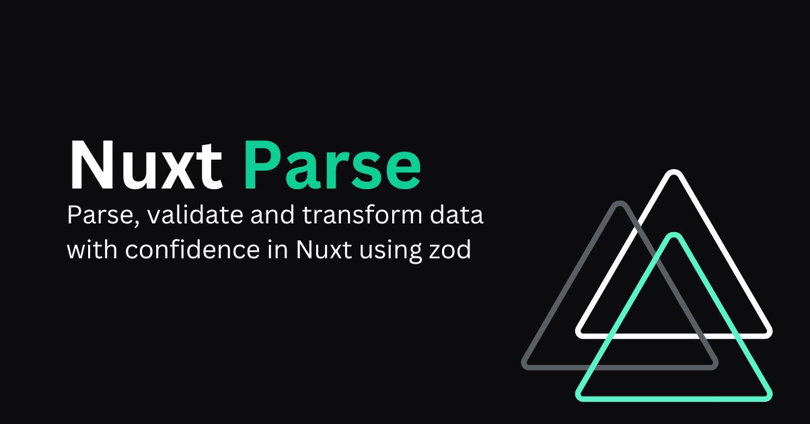

# nuxt-parse

[![npm version][npm-version-src]][npm-version-href]
[![npm downloads][npm-downloads-src]][npm-downloads-href]
[](https://GitHub.com/sidebase/nuxt-parse/)
[![License][license-src]][license-href]
[](https://twitter.com/sidebase_io)
[](https://discord.gg/9MUHR8WT9B)

> A nuxt focused package to make data validation and parsing easy. This package follows the design philosophy of the article [parse, don't validate](https://lexi-lambda.github.io/blog/2019/11/05/parse-don-t-validate/). It uses [`zod`](https://github.com/colinhacks/zod) for parsing data from the user, APIs, your own functions, ...

## Quick Start

```sh
npm i @sidebase/nuxt-parse
```

Then visit the [Quick Start documentation](https://sidebase.io/nuxt-parse/getting-started/quick-start) to setup the package.

## Features

- ✔️ Validate Data using [`zod`](https://github.com/colinhacks/zod)
- ✔️ Deserialize and Serialize user, backend, api data
- ✔️ Helpers focused on Nuxt 3 usage and developer experience

<!-- Badges -->
[npm-version-src]: https://img.shields.io/npm/v/@sidebase/nuxt-parse/latest.svg
[npm-version-href]: https://npmjs.com/package/@sidebase/nuxt-parse

[npm-downloads-src]: https://img.shields.io/npm/dt/@sidebase/nuxt-parse.svg
[npm-downloads-href]: https://npmjs.com/package/@sidebase/nuxt-parse

[license-src]: https://img.shields.io/npm/l/@sidebase/nuxt-parse.svg
[license-href]: https://npmjs.com/package/@sidebase/nuxt-parse

## Development

- Run `npm run test` to generate type stubs
- Run `npm run lint` to run eslint
- Run `npm run type` to run typescheck via tsc
- Run `npm publish` to run build and publish the package
